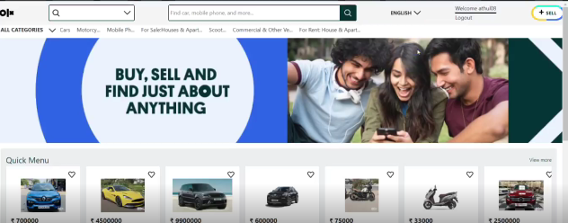

<div align="center">

# 🛒 REACT OLX CLONE (FIREBASE)
### *A Full-Stack Classifieds Marketplace*

[](https://react.dev/)
[](https://firebase.google.com/)
[](https://react.dev/learn/passing-data-deeply-with-context)

**A secure, scalable marketplace application for buying and selling products with real-time data synchronization.**
</div>

---

## 📖 Overview
The **OLX Clone** is a robust full-stack application that replicates the core functionality of a modern classifieds platform. It moves beyond static UI by implementing a complete **CRUD (Create, Read, Update, Delete)** workflow, allowing users to create accounts, post advertisements with images, and browse real-time listings.

---

## 📸 Preview



---

## ✨ Key Technical Features
* **🔐 Secure Authentication:** User signup and login managed via **Firebase Auth**.
* **📁 Real-time Database:** Product details, prices, and categories stored and synced instantly using **Cloud Firestore**.
* **🖼️ Cloud Storage:** Implementation of **Firebase Storage** for hosting user-uploaded product images.
* **⚡ Global State Management:** Utilizes **React Context API** and a `store/` directory to manage user sessions across the app.
* **📱 Responsive Pages:** Dedicated `Pages/` structure for Home, Login, Signup, and Product View.

---

## 🏗️ Project Architecture
The project is organized to separate concerns between UI, Logic, and Backend:
- **`Components/`**: Reusable UI elements (Header, Footer, Post cards).
- **`Pages/`**: Main view logic for specific routes.
- **`firebase/`**: Centralized configuration and initialization of the Firebase SDK.
- **`store/`**: Context providers for managing global app state.


---

## 💻 Tech Stack
| Layer | Technology |
| :--- | :--- |
| **Frontend** | React.js |
| **Authentication** | Firebase Auth |
| **Database** | Google Cloud Firestore |
| **File Storage** | Firebase Cloud Storage |
| **State Management** | React Context API |

---

## 🚦 Getting Started

### Prerequisites
* Node.js (v16+)
* A Firebase Project (Set up at [console.firebase.google.com](https://console.firebase.google.com/))

### Installation & Setup
1. **Clone the repository:**
   ```bash
   git clone [https://github.com/faizal08/REACT-OLX-CLONE-WITH-FIREBASE.git](https://github.com/faizal08/REACT-OLX-CLONE-WITH-FIREBASE.git)
``
2. Install dependencies:

```bash
npm install
```

3.Firebase Configuration:
```
Create a config.js inside the firebase/ folder and add your Firebase credentials.
```

4.Run the application:

```bash
npm start
````

## 📧 Contact
- *Developer:* [Faizal](https://github.com/faizal08)
- *Email:* [reachfaizal08@gmail.com](mailto:reachfaizal08@gmail.com)
